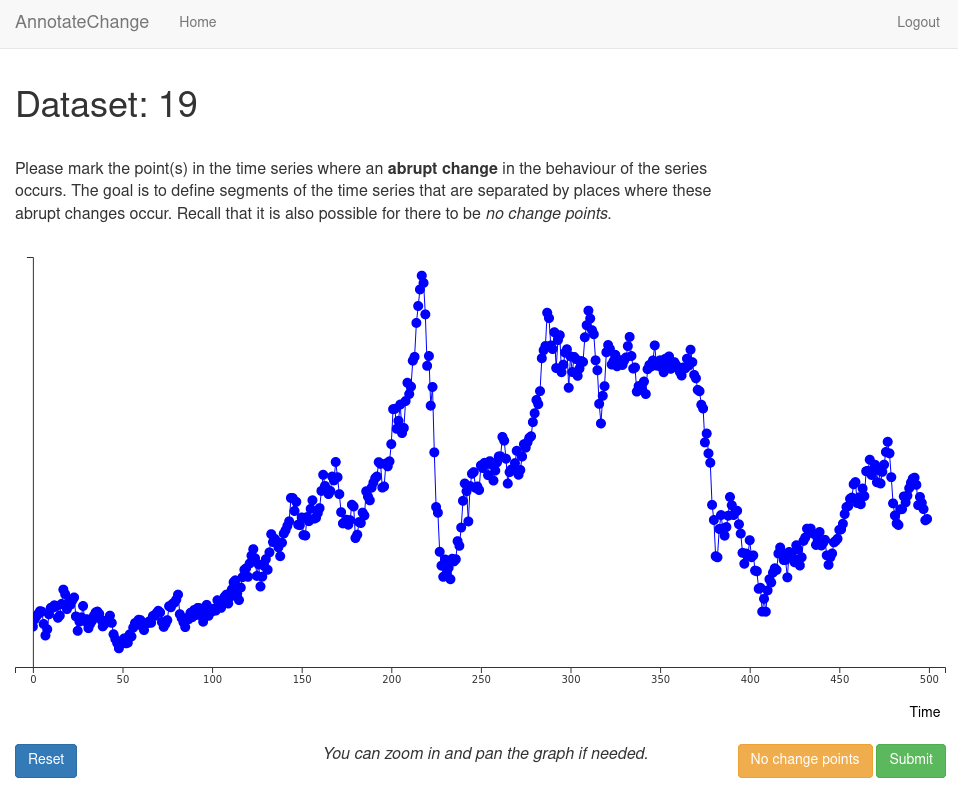

# AnnotateChange

Welcome to the repository of the "AnnotateChange" application. This 
application was created to collect annotations of time series data in order to 
construct the [Turing Change Point 
Dataset](https://github.com/alan-turing-institute/TCPD) (TCPD). The TCPD is a 
dataset of real-world time series used to evaluate change point detection 
algorithms. For the change point detection benchmark that was created using 
this dataset, see the [Turing Change Point Detection 
Benchmark](https://github.com/alan-turing-institute/TCPDBench) repository.

Any work that uses this repository should cite our paper: [**Van den Burg & 
Williams - An Evaluation of Change Point Detection Algorithms 
(2020)**](https://arxiv.org/abs/2003.06222). You can use the following BibTeX 
entry:

```bib
@article{vandenburg2020evaluation,
        title={An Evaluation of Change Point Detection Algorithms},
        author={{Van den Burg}, G. J. J. and Williams, C. K. I.},
        journal={arXiv preprint arXiv:2003.06222},
        year={2020}
}
```

Here's a screenshot of what the application looks like during the annotation 
process:

<p align="center">

</p>

Some of the features of AnnotateChange include:

* Admin panel to add/remove datasets, add/remove annotation tasks, add/remove 
  users, and inspect incoming annotations.

* Basic user management: authentication, email confirmation, forgotten 
  password, automatic log out after inactivity, etc. Users are only allowed to 
  register using an email address from an approved domain.

* Task assignment of time series to user is done on the fly, ensuring no user 
  ever annotates the same dataset twice, and prioritising datasets that are 
  close to a desired number of annotations.

* Interactive graph of a time series that supports pan and zoom, support for 
  multidimensional time series.

* Mandatory "demo" to onboard the user to change point annotation.

* Backup of annotations to the admin via email.

* Time series datasets are verified upon upload acccording to a strict schema.

## Notes

This codebase is provided "as is". If you find any problems, please raise an 
issue [on GitHub](https://github.com/alan-turing-institute/annotatechange).

The code is licensed under the [MIT License](./LICENSE).

This code was written by [Gertjan van den Burg](https://gertjan.dev) with 
helpful comments provided by [Chris 
Williams](https://homepages.inf.ed.ac.uk/ckiw/).

## Some implementation details

Below are some thoughts that may help make sense of the codebase.

* AnnotateChange is a web application build on the Flask framework. See [this 
  excellent 
  tutorial](https://blog.miguelgrinberg.com/post/the-flask-mega-tutorial-part-i-hello-world) 
  for an introduction to Flask. The [flask.sh](./flask.sh) shell script loads 
  the appropriate environment variables and runs the application in a virtual 
  environment managed by Poetry.

* The application handles user management and is centered around the idea of a 
  "task" which links a particular user to a particular time series to 
  annotate.

* An admin role is available, and the admin user can manually assign and 
  delete tasks as well as add/delete users, datasets, etc. The admin user is 
  created using the [cli](./app/cli.py).

* All datasets must adhere to a specific dataset schema (see 
  [utils/dataset_schema.json](app/utils/dataset_schema.json)).

* Annotations are stored in the database using 0-based indexing. Tasks are 
  assigned on the fly when a user requests a time series to annotate (see 
  [utils/tasks.py](app/utils/tasks.py)).

* Users can only begin annotating when they have successfully passed the 
  introduction.

* Configuration of the app is done through environment variables, see the 
  [.env.example](.env.example) file for an example.

* [Poetry](https://python-poetry.org/) is used for dependency management.

* Docker is used for deployment (see the deployment documentation in 
  [docs](docs)), and [Traefik](https://containo.us/traefik/) is used for SSL, 
  etc.

* The time series graph is plotted using [d3.js](https://d3js.org/).
